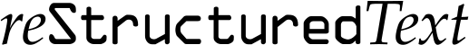
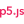

<!-- :bangbang: --- under construction --- :bangbang: -->

:wave: Hi, I am Stefano
=======================

I am a **Mathematician** :mortar_board: and **Jr. Full Stack Developer**.

Moved by my passion for Mathematics I followed a purely academic path. Once I reached a crossroad in my career I decided to follow another passion of mine and dived into the world of web development.

In mid September 2021 I enrolled in a 14(+3)-weeks bootcamp @[EPICODE School](https://epicode.it) to learn about Full Stack Development.

I have designed and developed the [SARKAS](https://github.com/murillo-group/sarkas) [website](https://murillo-group.github.io/sarkas/) for the [Murillo-Group at MSU](https://murillogroupmsu.com/) which went live November 2021. It was built with [Sphinx](https://www.sphinx-doc.org), a Python static website generator that is mainly used for documentation-type websites.

At the moment I work at [OLab s.r.l.s.](https://olab-studio.com), a small team of amazing Django/Python developers located around Italy.

On the side I maintain the SARKAS website, I contribute to Open Source projects, and I am developing my own Python package that I hope to use in my math research.

---
---

:computer: Tech Info
--------------------

  
GitHub Stats

<!--    -->
  

  
Skills

  * Markup Languages
    

    
    
    
    

    

  * Programming languages with which I have experimented
    

    
    
    
    
    

    

  * Libraries I have been learning
    

    
    
    

    

  * Databases
    

    
    
    
    

    

  * Frameworks with which I have played
    

    
    
    
    
    
    

    

  * CMS I have used
    

    
    

    

  * Software
    

    
      
    
    
    

    

---
---

:relaxed: More about me
-------------

💬 Pronouns: he/him/his

✨ In am bilingual: Italian :it: and English :us:

👀 Fun fact: I enjoy juggling 🤹 and puzzles

📫 How to reach me:  

